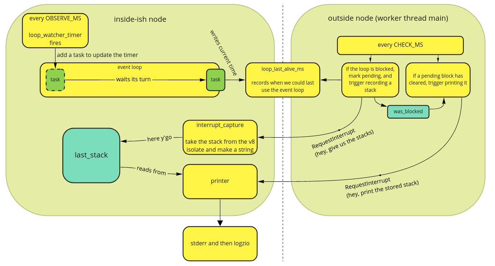

# node-dump-stacks

A node native module (NaN) which watches the node event loop for blockages.
When a blockage is observed, it prints the javascript stack. This gives you a
chance to diagnose what's gone wrong.


## What does it look like?

There's a test program in `test/child.js` which intentionally blocks up for the
specified number of ms, you can run it like this:

```
% node test/child-initial-delays.js 1200
{"name":"dump-stacks","blockedMs":1203,"stack":"burnFor (/foo/test/child-initial-delays.js:22:5)\n/foo/test/child-initial-delays.js:12:3\n"}
```

The default, without configuration, is to alert on blocks for more than a second
(1,000ms), which show up here. You can see the very raw javascript stacks; no
processing of sourcemaps is done, and no attempt is made to hide the node internals.
`async` stack traces are not processed.


## Requirements

 * a "modern" c++ toolchain installed (2019+ on linux)
   * note: `circle/node:14` images are no good, try `cimg/node:14.20`
       or `circle/node:14-buster` or, preferably, much newer


## Usage

Install the [npm package](@snyk/node-dump-stacks): `npm install --save @snyk/node-dump-stacks`.

Load the module on start-up: `require('@snyk/node-dump-stacks');` (JS) or `import '@snyk/node-dump-stacks';` (ES/TS)

It reads the environment, and starts immediately.

It writes json lines to `stderr`, in a format similar to
[`bunyan`](https://github.com/trentm/node-bunyan) / [`pino`](https://github.com/pinojs/pino).

As this is a native module, it is sensitive to `node` build and runtime versions. That is, you cannot build on one
version, then run on a different version, and you cannot build on one platform and run on another.
There are no binaries available for this package, either in the source, in the npm package, or in THE CLOUD.
If you are struggling with CI vs. docker image, consider adding `npm rebuild` to your `Dockerfile`, which will
isolate your production build from your CI build.


## Local development
Node v14, v16 and v18 are currently supported. Other versions are likely to work, PRs accepted.


### Development
Make your changes and run `npm run build` and `npm run test`.
`npm run test` *does not* run a C++ build, so you must do so manually.


### Troubleshooting
If you run into problems with `gyp: No Xcode or CLT version detected!`, follow
[instructions from node-gyp repo](https://github.com/nodejs/node-gyp/blob/master/macOS_Catalina.md#i-did-all-that-and-the-acid-test-still-does-not-pass--).


## Configuration

 * `DUMP_STACKS_REPORT_ONCE_MS=1000`: If the loop is blocked for this number of
     milliseconds, print the stack.
 * `DUMP_STACKS_OBSERVE_MS=100`: Record details about the event loop about this
     often.
 * `DUMP_STACKS_CHECK_MS=100`: Check up on the event loop about this often.
 * `DUMP_STACKS_IGNORE_INITIAL_SPINS=1`: Wait for this many observations before
     attempting to report blocks.
 * `DUMP_STACKS_OUTPUT_STDOUT=1`: Output blocked event loop logs to stdout. Defaults to stderr.
 * `DUMP_STACKS_ENABLED=false`: Do Nothing At All; don't even execute the native module

The first value is up to you. Set it too low, and you will get a lot of reports,
and a report has some overhead. Set it too high and you won't get any reports.
One second is a *long* time.

The other time values would need to be lowered if you want to see blocks shorter than
those values, at the expense of being less efficient (although probably not
measurably so!).

`DUMP_STACKS_IGNORE_INITIAL_SPINS` should help ignore blocks which happen at
startup time in an application, say a webserver, which are likely not interesting to
overall application performance.  Set to `0` if you have a script, and you want to see
all blocks after the initial `import`/`require`.

The unit here is actual timer firings, so the defaults, `1` * `${DUMP_STACKS_OBSERVE_MS}`
(`100ms`) means ignore blocks that happen in the first 100ms, *plus* however long it
takes for the loop to spin once.


## How does it work?

As a native module, it can do things in C++ which are not affected by the
event loop, but can still observe the health of the event loop, and interact
with the javascript stack.

It performs functionality equivalent to the following JS, but there is no JS
involved; it is all in C++. This is a slight simplification, but surprisingly
close to the actual implementation.

We get the event loop to record when it was last alive:
```js
withTheMainEventLoop(() => {
  setInterval(() => {
    lastAlive = Date.now();
    wroteThisBlock = false;
  }, DUMP_STACKS_OBSERVE_MS);
});
```


We then have a worker thread which checks whether the event loop is wedged,
and respond by logging:
```js
inAnIndependentThread(async () => {
  for (;;) {
    await sleep(DUMP_STACKS_CHECK_MS);

    const loopBlockedMs = Date.now() - lastAlive;
    if (loopBlockedMs > DUMP_STACKS_REPORT_ONCE_MS && !wroteThisBlock) {
      logStack();
      wroteThisBlock = true;
    }
  }
});
```




## Future work
 
 * Benchmarks.
 * Report the stack continuously, as a form of low-overhead profiler.
 * Report a stack at the "end" of a long block, with the actual total block time.
 * Write stacks to a different destination, e.g. a webhook.


## License

MIT
